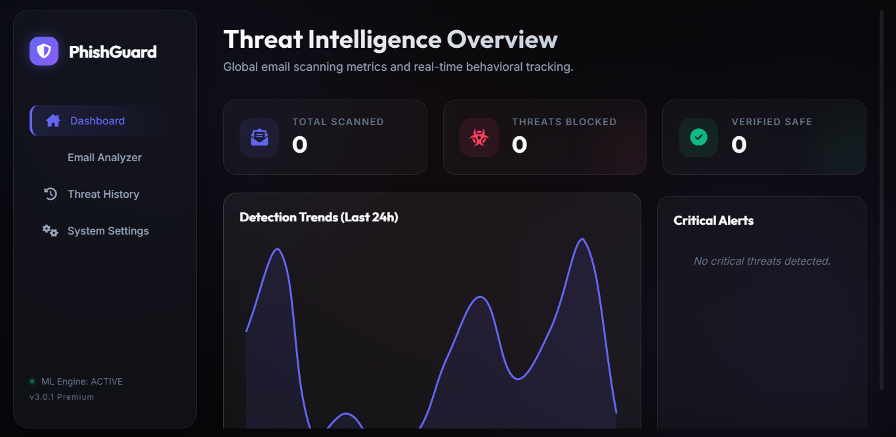
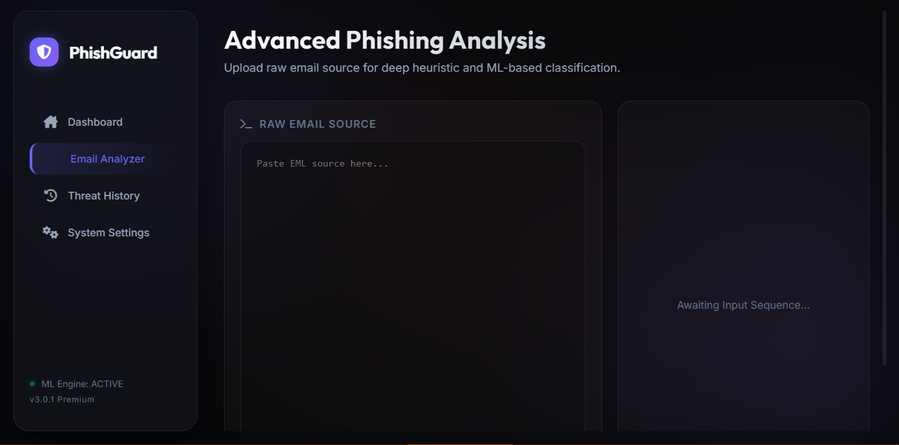
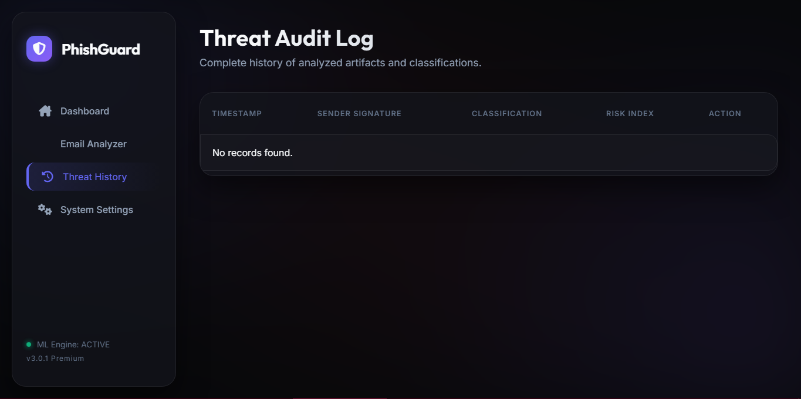
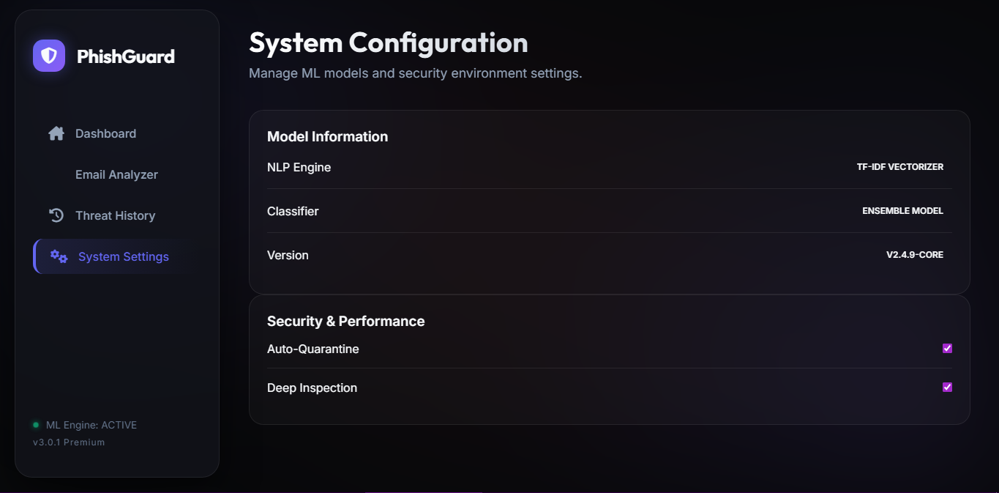

# 🛡️ PhishGuard | AI-Driven Threat Intelligence

**PhishGuard** is a high-performance, professional-grade cybersecurity platform designed to detect and neutralize sophisticated phishing attempts using a hybrid approach of **Heuristic Triage** and **Machine Learning Analysis**.

---

## Preview 

1.


2.  


3.  


4.  


---

## 🚀 Quick Start (Installation)

1.  **Clone & Setup**:
    ```bash
    git clone https://github.com/kushal-soni-official/PhishGuard.git
    cd phishguard
    python -m venv venv
    venv\Scripts\activate  # On Windows
    ```
2.  **Install Essentials**:
    ```bash
    pip install -r requirements.txt
    ```
3.  **Launch Platform**:
    ```bash
    python app.py
    ```
    Navigate to `http://localhost:5000` to access the dashboard.

## ✨ Usage Guide

PhishGuard is designed to be simple and intuitive. Follow these steps to start scanning for threats:

### 1. The Real-Time Dashboard
The dashboard provides live telemetry of threats. You can track:
*   **Total Scanned**: Cumulative count of analysis requests.
*   **Phishing Detected**: Number of verified threats blocked.
*   **Safe Artifacts**: Benign emails that passed the check.
*   **Threat Intensity**: A dynamic chart showing attack patterns over time.

### 2. Performing a Scan
Navigate to the **Scanner** tab via the sidebar:
1.  **Paste Email Content**: Copy the raw content or EML source of a suspicious email into the analyzer field.
2.  **Run AI Diagnostics**: Click the `RUN AI DIAGNOSTICS` button to begin the analysis.
3.  **Analyze Results**: Review the **Behavioral Artifacts** (e.g., suspicious keywords, entropy level, or sender mismatch).

### 3. Understanding the Risk Meter
*   **0-30% (SAFE)**: Low risk, likely a benign communication.
*   **31-70% (SUSPICIOUS)**: Moderate risk, requires manual review.
*   **71-100% (CRITICAL)**: High risk phishing attempt. **Avoid clicking any links!**

---

## 🧠 AI & Detection Engine
PhishGuard uses a multi-layered detection strategy:
*   **Heuristic Analysis**: Checks for known phishing patterns and sender discrepancies.
*   **Machine Learning**: A **Random Forest** model trained on a massive dataset of phishing and benign emails.
*   **NLP Processing**: Analyzes language semantics to detect urgency, fear-mongering, and deceptive tactics.

## 📂 Project Structure

```text
phishguard/
├── backend/                # Core Application Logic
│   ├── models/             # ML Implementation & Feature Extraction
│   ├── routes/             # RESTful API Endpoints
│   ├── static/             # Frontend Assets (Glassmorphism UI)
│   ├── templates/          # HTML5 Templates
│   └── utils/              # NLP & Text Utilities
├── dataset/                # Training Data for the AI Engine
├── models/                 # Pre-trained ML weights (.pkl)
├── tests/                  # Unit & Integration Tests
└── app.py                  # Server Entry Point
```

## 🛠️ Tech Stack

- **Frontend**: Vanilla JS (ES6+), CSS3 (Glassmorphism), Chart.js
- **Backend**: Python 3.10+, Flask, Socket.io
- **AI/ML**: Scikit-Learn, NLTK, NumPy, Joblib

## 🔮 Roadmap

1.  **🔗 Deep-Link Reputation**: Integration with VirusTotal for URL analysis.
2.  **🤖 Transformer Integration**: Upgrading to **BERT** for deep semantic understanding.
3.  **🦊 Browser Extension Sync**: Real-time inbox scanning via browser plugin.
4.  **🔒 Automated Quarantine**: Integrating with IMAP/SMTP to move high-risk emails.

---
*Developed by the PhishGuard Security Team • Protecting the Digital Frontier*
